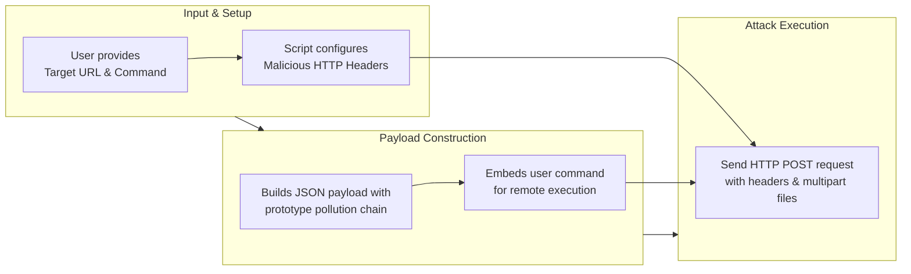

Before examining the script, it's crucial to understand the vulnerability it targets, CVE-2025-55182. This is a **critical, unauthenticated Remote Code Execution (RCE) flaw** with a maximum CVSS score of 10.0. Here’s a breakdown of the issue:

*   **Root Cause**: It's a **server-side prototype pollution** vulnerability within the deserialization logic of React Server Components' "Flight" protocol.
*   **Exploitation**: By sending a specially crafted HTTP POST request, an attacker can pollute the prototype chain of objects on the server. This manipulation can trick the server into executing arbitrary JavaScript code, such as commands via `child_process.execSync()`.
*   **Affected Systems**: The vulnerability impacts React 19.x and Next.js (versions 15.x and 16.x using the App Router), **even if the application does not explicitly use server functions**.

### **Role of the Provided Python Script**

The script you provided is **not the vulnerability itself**. It is an **exploit tool (Proof-of-Concept or PoC)** that weaponizes the vulnerability. Its sole purpose is to craft and send the malicious HTTP request that triggers the RCE on a vulnerable target.

### **Line-by-Line Analysis of the Exploit Script**

The script's structure and attack flow can be summarized as follows:

Here is a detailed explanation of the key parts of the code:

*   **Lines 1-10 (Script Setup & Input)**: The script checks for command-line arguments. A user must provide a target `URL` and a `command` to execute on the vulnerable server (e.g., `id`, `whoami`, or a reverse shell command).

*   **Lines 12-20 (Malicious Headers)**: The script sets specific HTTP headers to mimic a legitimate request and trigger the vulnerable code path.
    *   `"Next-Action": "x"` and `"X-Nextjs-Request-Id"`: These are critical. Security advisories specifically mention checking logs for requests with `next-action` headers as an indicator of compromise.
    *   The `User-Agent` is disguised to look like a normal browser.

*   **Lines 22-34 (The Exploit Payload - `files` dictionary)**: This is the core of the exploit. The script sends the data as multipart form fields (`files`), which contain a serialized JavaScript object designed to trigger the prototype pollution.
    *   **Key `"0"`**: Contains the primary malicious JSON payload.
        *   `"then":"$1:__proto__:then"`: This is the prototype pollution chain. It attempts to assign a value to the `then` property of the `Object.prototype` (`__proto__`), which can influence the behavior of Promises and other objects.
        *   `"_response": { "_prefix": "process.mainModule.require('child_process').execSync('{command}');", ... }`: This is where the user's command gets injected. It instructs the polluted server-side JavaScript to load the Node.js `child_process` module and execute the provided command synchronously.
    *   **Keys `"1"` and `"2"`**: These appear to be supporting parts of the exploit chain, likely referencing other parts of the polluted object structure (`"$@0"`) or providing necessary array structures (`"[]"`).

*   **Lines 36-38 (Sending the Attack)**: The script uses the `requests` library to send an HTTP POST request to the target URL, incorporating the malicious headers and the multipart `files` payload. It then prints the HTTP status code and response text.

### **Critical Security Implications**

1.  **This is a Weapon**: This script is a functional weapon for a critical RCE flaw. Running it against a system you do not own or have explicit permission to test is illegal.
2.  **Active Exploitation**: This vulnerability is being actively exploited in the wild by threat actors. The script's pattern (specific headers and JSON structures) matches the Indicators of Compromise (IoCs) that defenders are told to look for.
3.  **Remediation is Urgent**: The **only definitive mitigation** is to immediately update React and Next.js to their patched versions. Relying on network-level protections (like WAF virtual patches) is only a temporary measure.

### **How to Detect an Attack Attempt**

Based on this script and threat intelligence, you can monitor for these signs of an exploitation attempt:
*   **Network Logs**: Look for HTTP POST requests containing the headers `Next-Action` or `rsc-action-id`.
*   **Request Body**: Look for patterns like `"$@"`, `"status":"resolved_model"`, and `__proto__` within the POST data.
*   **Host Logs**: Alert on unexpected commands (like `whoami`, `id`, `curl` to external IPs) or file writes (`/tmp/pwned.txt`) originating from your Node.js application process.

I hope this detailed breakdown helps you understand the mechanics of both the exploit script and the severe vulnerability it targets. If you are responsible for React or Next.js applications, prioritizing patching is the most critical action you can take.