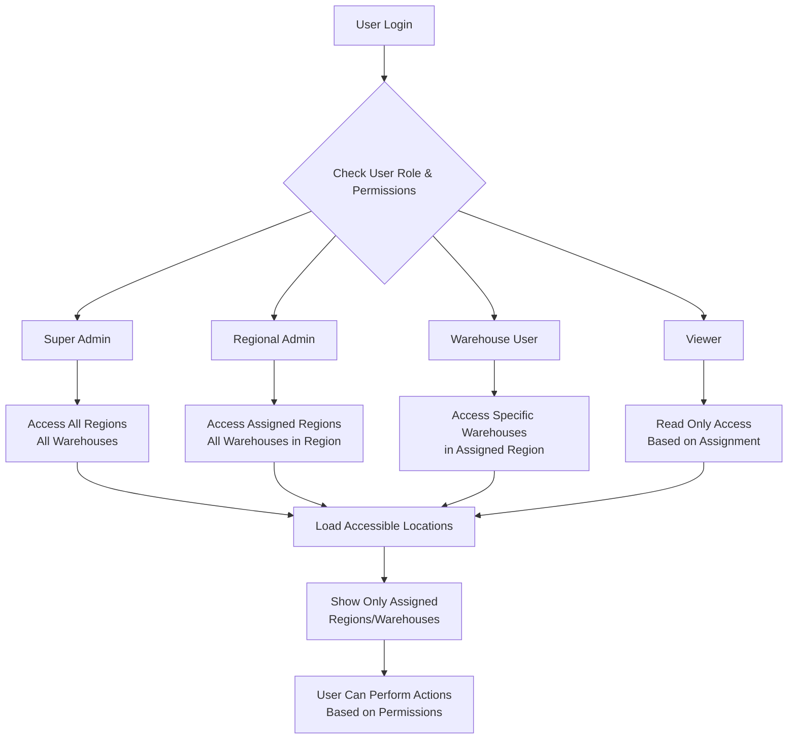
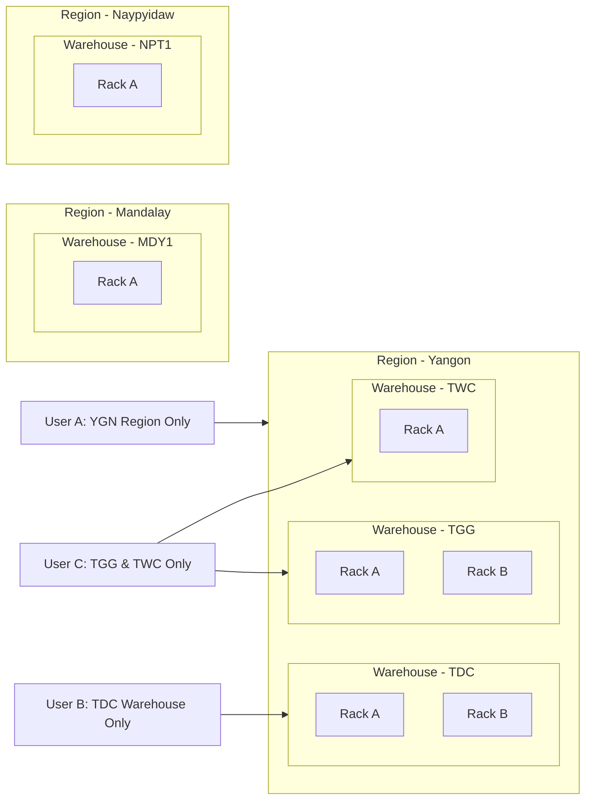
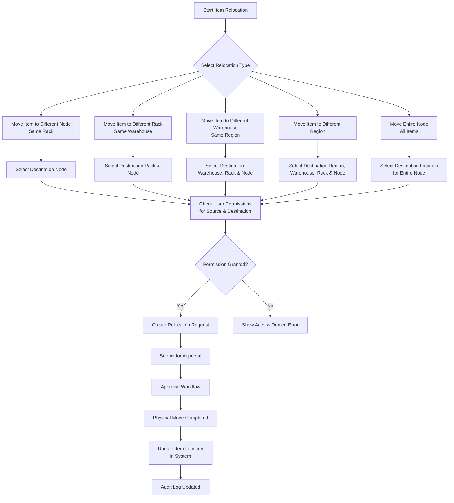
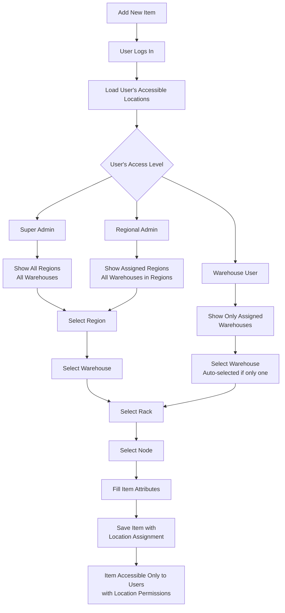
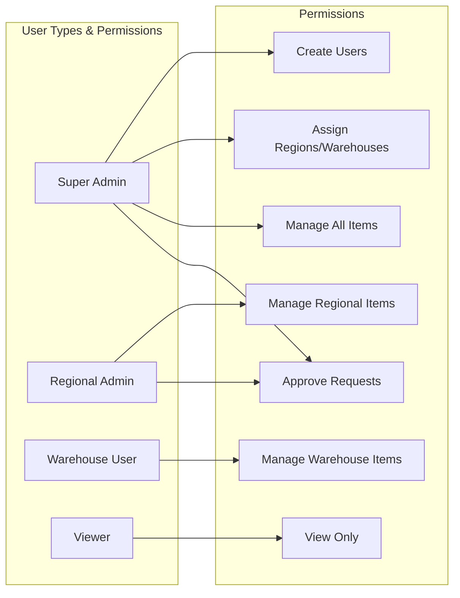
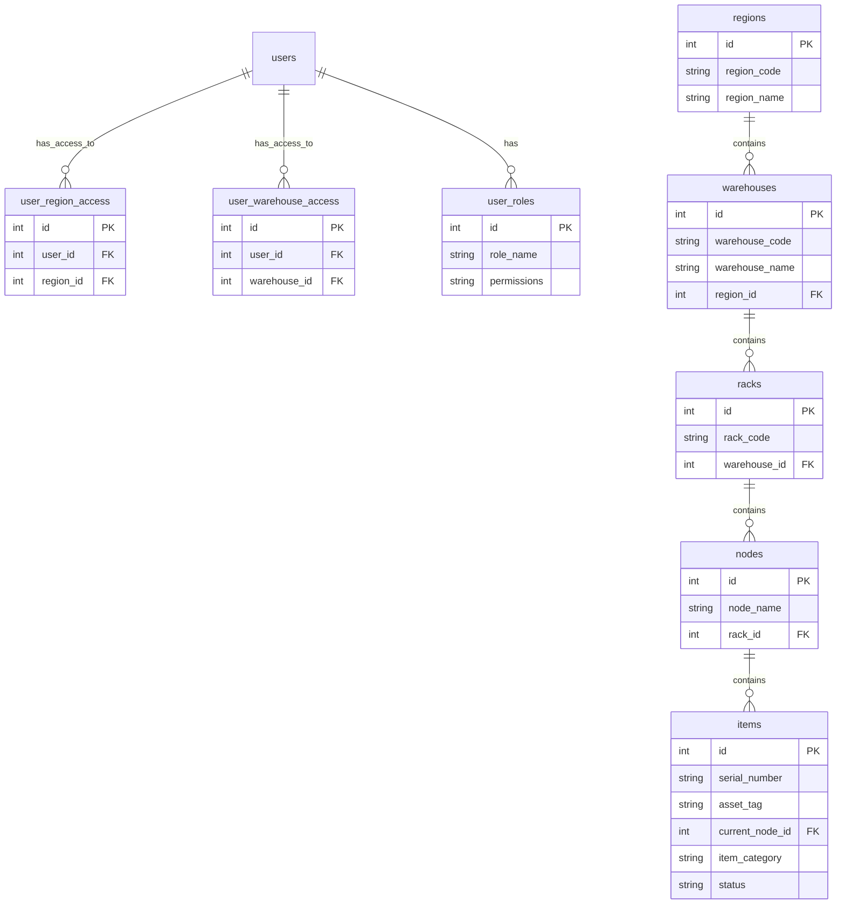

## **User & Access Management Workflow**

## **Region & Warehouse Access Structure**

## **Item Relocation Workflow**

## **Item Creation & Location Assignment**

## **User Permission Matrix**

## **Database Structure for Access Control**

