---

##  ACCESS WORKFLOW DIAGRAM

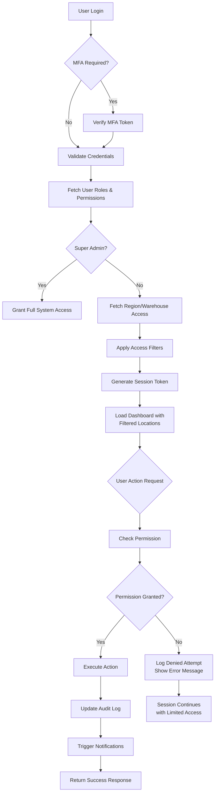

---

## REGION & WAREHOUSE STRUCTURE DIAGRAM

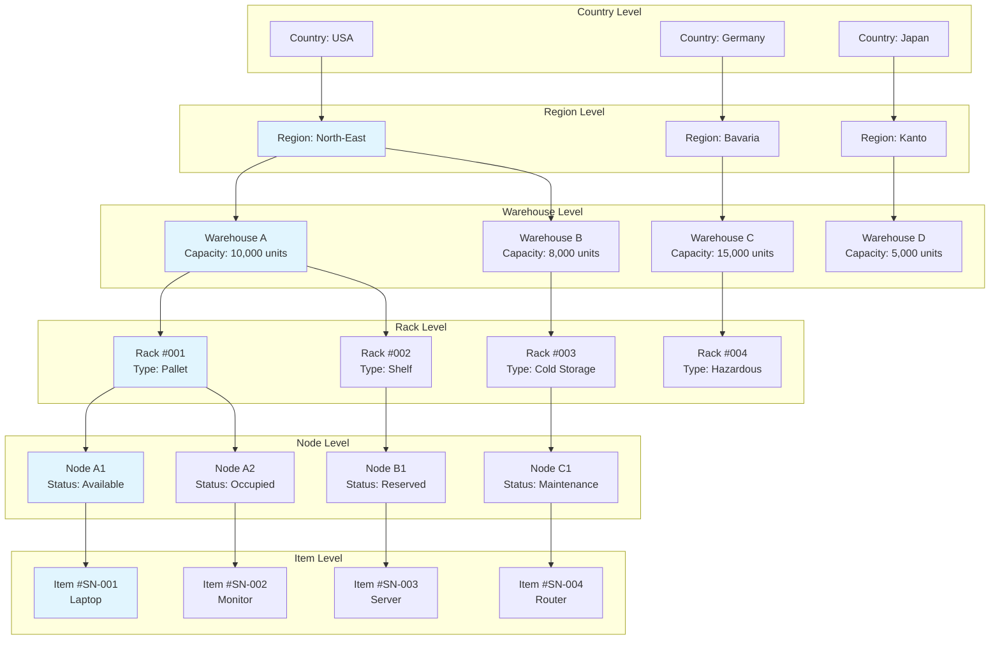

---

## ITEM RELOCATION WORKFLOW DIAGRAM

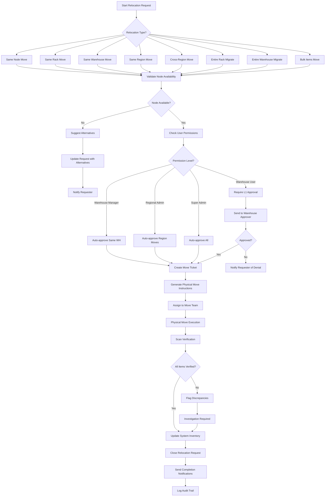

---

## ITEM CREATION WORKFLOW DIAGRAM

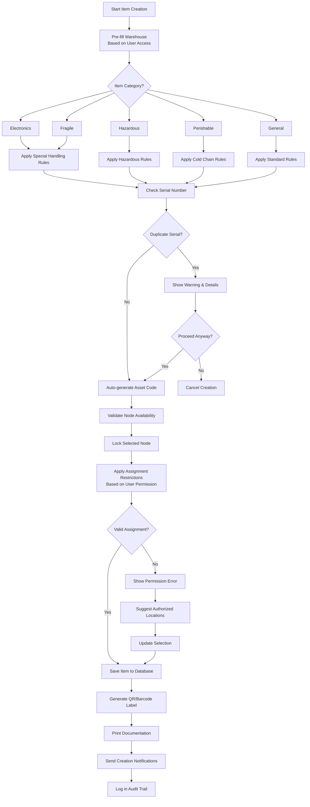

---
## FULL DATABASE ERD

```mermaid
erDiagram
    users ||--o{ user_roles : has
    users ||--o{ user_region_access : "can access"
    users ||--o{ user_warehouse_access : "can access"
    users ||--o{ user_rack_access : "can access"
    users ||--o{ login_sessions : "creates"
    users ||--o{ mfa_tokens : "uses"
    users ||--o{ audit_logs : "generates"
    
    roles ||--o{ role_permissions : "contains"
    roles ||--o{ user_roles : "assigned to"
    
    regions ||--o{ warehouses : contains
    regions ||--o{ user_region_access : "accessible by"
    
    warehouses ||--o{ racks : contains
    warehouses ||--o{ user_warehouse_access : "accessible by"
    
    racks ||--o{ nodes : contains
    racks ||--o{ user_rack_access : "accessible by"
    
    nodes ||--o{ items : stores
    nodes ||--o{ item_status_history : "tracks status"
    
    items ||--o{ item_movement_logs : "tracks movement"
    items ||--o{ item_assignment_history : "tracks assignment"
    items ||--o{ relocation_items : "included in"
    
    item_categories ||--o{ items : categorizes
    
    relocation_requests ||--o{ relocation_items : includes
    relocation_requests ||--o{ relocation_approvals : requires
    relocation_requests ||--o{ relocation_status : tracks
    
    users ||--o{ relocation_approvals : approves
    
    users {
        bigint id PK
        varchar email UK
        varchar password_hash
        varchar full_name
        boolean is_active
        boolean mfa_enabled
        timestamp last_login
        timestamp created_at
        timestamp updated_at
        timestamp deleted_at
    }
    
    roles {
        bigint id PK
        varchar name UK
        varchar description
        integer access_level
        boolean is_system_role
        timestamp created_at
    }
    
    role_permissions {
        bigint id PK
        bigint role_id FK
        varchar permission_code
        varchar resource_type
        jsonb allowed_actions
        timestamp created_at
    }
    
    user_roles {
        bigint id PK
        bigint user_id FK
        bigint role_id FK
        timestamp assigned_at
        bigint assigned_by FK
        timestamp expires_at
    }
    
    user_region_access {
        bigint id PK
        bigint user_id FK
        bigint region_id FK
        boolean can_manage
        boolean can_view
        boolean can_edit
        timestamp granted_at
        timestamp expires_at
    }
    
    user_warehouse_access {
        bigint id PK
        bigint user_id FK
        bigint warehouse_id FK
        boolean can_manage
        boolean can_view
        boolean can_edit
        timestamp granted_at
        timestamp expires_at
    }
    
    user_rack_access {
        bigint id PK
        bigint user_id FK
        bigint rack_id FK
        boolean can_manage
        boolean can_view
        boolean can_edit
        timestamp granted_at
        timestamp expires_at
    }
    
    regions {
        bigint id PK
        varchar code UK
        varchar name
        bigint country_id FK
        varchar timezone
        jsonb metadata
        boolean is_active
        timestamp created_at
        timestamp updated_at
    }
    
    warehouses {
        bigint id PK
        varchar code UK
        varchar name
        bigint region_id FK
        varchar address
        decimal latitude
        decimal longitude
        integer capacity
        integer current_occupancy
        varchar status
        jsonb operating_hours
        timestamp created_at
        timestamp updated_at
    }
    
    racks {
        bigint id PK
        varchar code UK
        bigint warehouse_id FK
        varchar type
        integer total_nodes
        integer available_nodes
        varchar status
        jsonb dimensions
        timestamp created_at
        timestamp updated_at
    }
    
    nodes {
        bigint id PK
        varchar code UK
        bigint rack_id FK
        varchar status
        varchar node_type
        jsonb properties
        timestamp last_occupied
        timestamp created_at
        timestamp updated_at
    }
    
    items {
        bigint id PK
        varchar asset_code UK
        varchar serial_number UK
        bigint category_id FK
        bigint current_node_id FK
        varchar name
        text description
        jsonb specifications
        varchar status
        decimal value
        timestamp acquisition_date
        timestamp warranty_expiry
        bigint assigned_to FK
        timestamp created_at
        timestamp updated_at
        timestamp deleted_at
    }
    
    item_categories {
        bigint id PK
        varchar name UK
        varchar code
        jsonb handling_instructions
        jsonb storage_requirements
        boolean requires_approval
        timestamp created_at
    }
    
    item_movement_logs {
        bigint id PK
        bigint item_id FK
        bigint from_node_id FK
        bigint to_node_id FK
        bigint moved_by FK
        timestamp moved_at
        varchar reason
        varchar move_type
        jsonb metadata
    }
    
    item_status_history {
        bigint id PK
        bigint item_id FK
        varchar old_status
        varchar new_status
        bigint changed_by FK
        timestamp changed_at
        varchar reason
    }
    
    item_assignment_history {
        bigint id PK
        bigint item_id FK
        bigint old_assignee FK
        bigint new_assignee FK
        bigint assigned_by FK
        timestamp assigned_at
        varchar reason
    }
    
    relocation_requests {
        bigint id PK
        uuid request_code UK
        varchar relocation_type
        bigint source_region_id FK
        bigint dest_region_id FK
        bigint source_warehouse_id FK
        bigint dest_warehouse_id FK
        bigint source_rack_id FK
        bigint dest_rack_id FK
        bigint requested_by FK
        timestamp requested_at
        varchar status
        timestamp scheduled_for
        timestamp completed_at
        text notes
        jsonb metadata
    }
    
    relocation_items {
        bigint id PK
        bigint request_id FK
        bigint item_id FK
        bigint from_node_id FK
        bigint to_node_id FK
        varchar item_status
        boolean is_verified
        timestamp verified_at
        bigint verified_by FK
    }
    
    relocation_approvals {
        bigint id PK
        bigint request_id FK
        bigint approver_id FK
        integer approval_level
        varchar decision
        timestamp decided_at
        text comments
    }
    
    relocation_status {
        bigint id PK
        bigint request_id FK
        varchar status
        timestamp changed_at
        bigint changed_by FK
        text notes
    }
    
    audit_logs {
        bigint id PK
        varchar event_type
        varchar resource_type
        bigint resource_id
        bigint user_id FK
        jsonb old_values
        jsonb new_values
        jsonb metadata
        timestamp created_at
        varchar ip_address
        varchar user_agent
    }
    
    notifications {
        bigint id PK
        varchar type
        bigint user_id FK
        varchar title
        text message
        jsonb data
        boolean is_read
        timestamp read_at
        timestamp created_at
        timestamp expires_at
    }
    
    system_settings {
        bigint id PK
        varchar key UK
        jsonb value
        varchar data_type
        varchar description
        timestamp updated_at
        bigint updated_by FK
    }
    
    mfa_tokens {
        bigint id PK
        bigint user_id FK
        varchar token_hash
        varchar method
        timestamp expires_at
        boolean is_used
        timestamp used_at
        timestamp created_at
    }
    
    login_sessions {
        bigint id PK
        bigint user_id FK
        varchar session_token
        timestamp started_at
        timestamp last_activity
        timestamp expires_at
        varchar ip_address
        varchar user_agent
        boolean is_active
    }
```

---

## CRUD OPERATIONS DIAGRAMS

### **User Management CRUD Workflow**
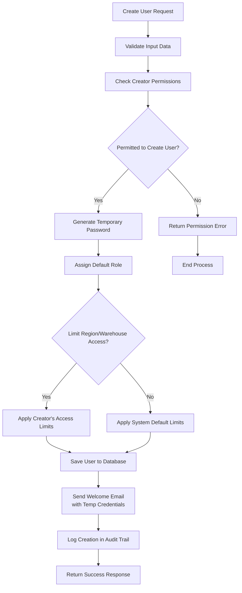

### **Inventory CRUD Workflow**
```mermaid
flowchart TD
    subgraph "CREATE Item"
        A1[Receive Item Data] --> A2[Validate Required Fields]
        A2 --> A3[Check Serial Duplication]
        A3 --> A4[Assign Location<br>Based on Rules]
        A4 --> A5[Generate Asset Code]
        A5 --> A6[Save to Database]
        A6 --> A7[Create Initial Audit Log]
    end
    
    subgraph "UPDATE Item"
        B1[Receive Update Request] --> B2[Check Update Permissions]
        B2 --> B3[Validate New Values]
        B3 --> B4[Check Location Change Rules]
        B4 --> B5[Update Record]
        B5 --> B6[Log Changes in History Tables]
    end
    
    subgraph "MOVE Item"
        C1[Initiate Move] --> C2[Check Move Permissions]
        C2 --> C3[Validate Target Location]
        C3 --> C4[Lock Source & Target Nodes]
        C4 --> C5[Update Current Node]
        C5 --> C6[Log Movement]
        C6 --> C7[Update Warehouse Occupancy]
    end
    
    subgraph "DELETE Item"
        D1[Request Deletion] --> D2[Check Delete Permissions]
        D2 --> D3{Soft or Hard Delete?}
        D3 -->|Soft| D4[Set deleted_at timestamp]
        D3 -->|Hard| D5[Check Dependencies]
        D4 --> D6[Free Up Node]
        D5 --> D7[Remove All References]
        D6 --> D8[Log Deletion]
        D7 --> D8
    end
```

### **Rack & Node Management CRUD**
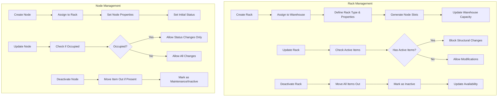

### **Warehouse Management CRUD**
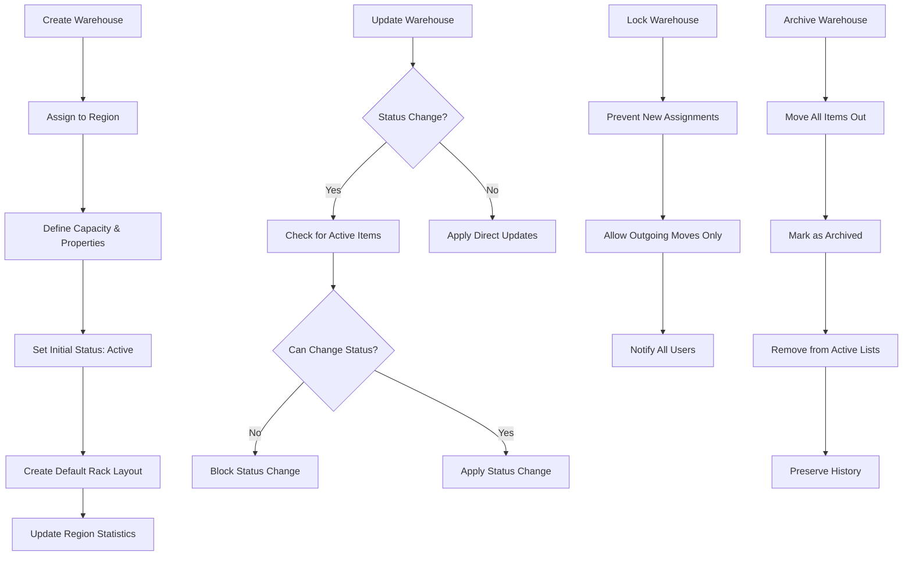

---

## APPROVAL WORKFLOW

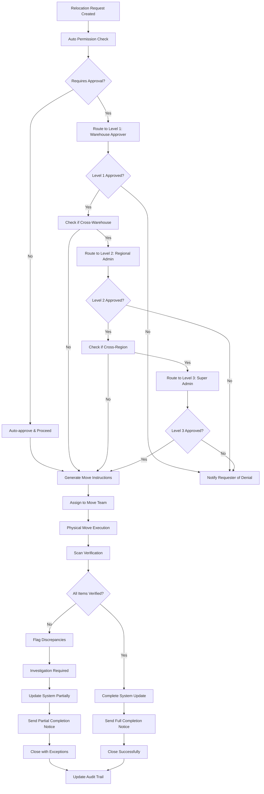

---

## ADDITIONAL DIAGRAMS

### **Permission Inheritance Hierarchy**
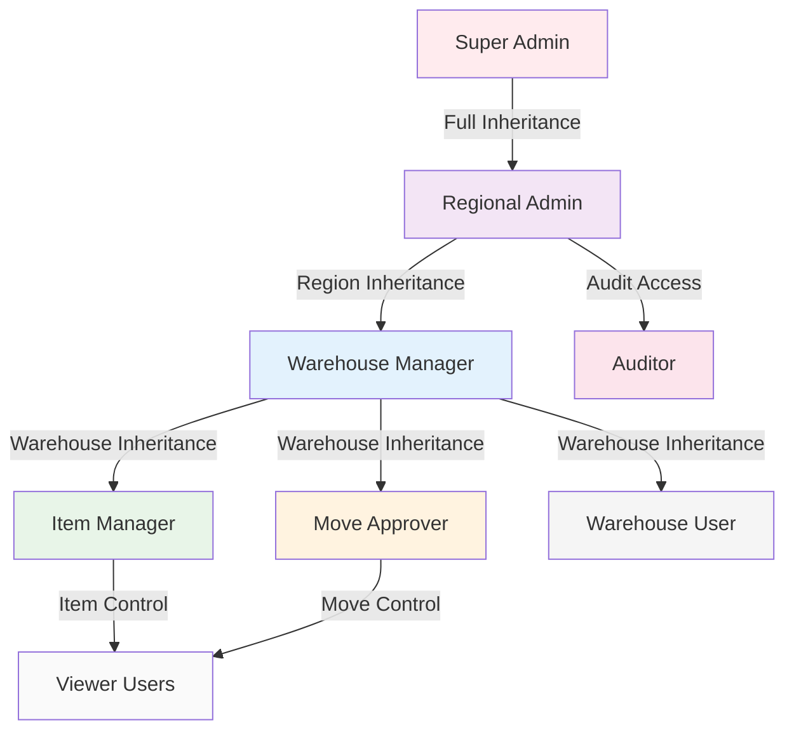

### **Notification Flow System**
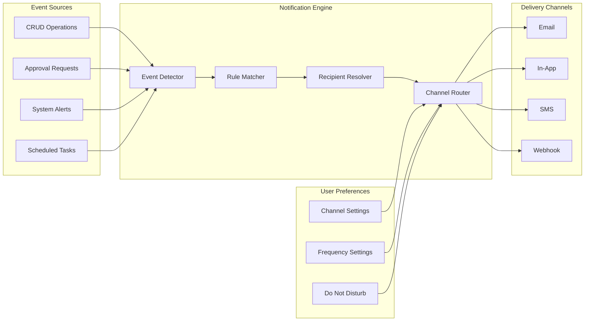

### **Audit Trail Data Flow**
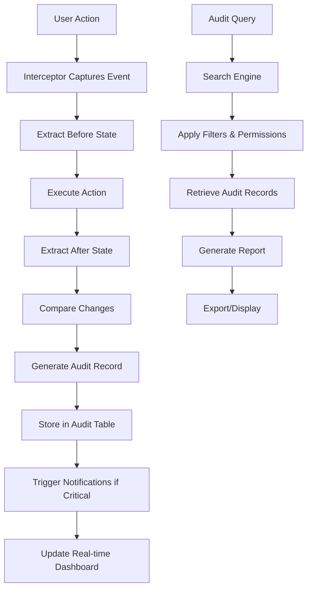

---
